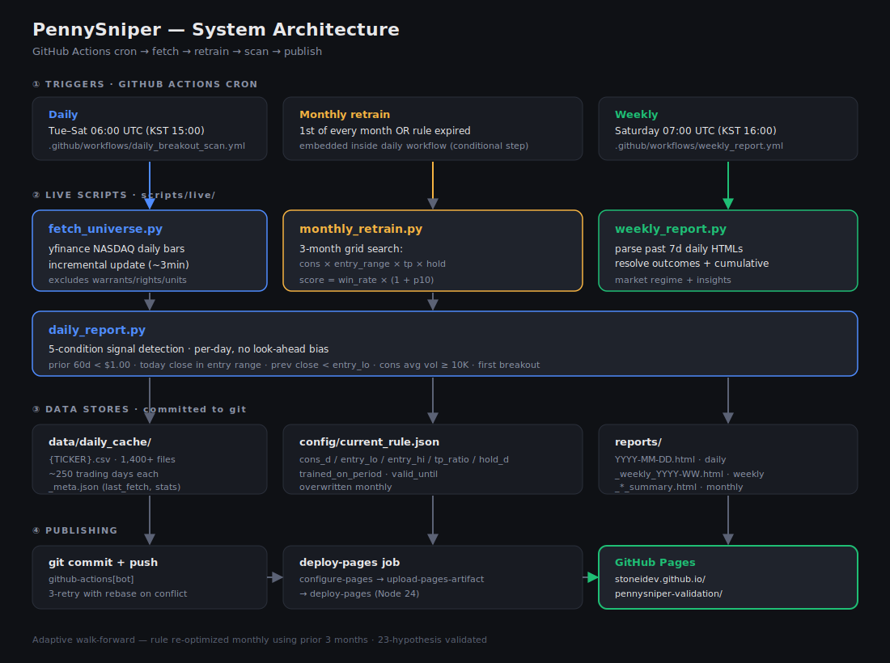

# PennySniper — Adaptive Penny Stock Breakout Scanner

> 매일 NASDAQ 페니스탁 universe를 자동 스캔, 매월 적응형으로 룰을 재최적화하는
> 자동매매 시그널 시스템.

**Live**: https://stoneidev.github.io/pennysniper-validation/

---

## What It Does

1. **매 평일** GitHub Action이 자동 실행:
   - yfinance에서 NASDAQ 페니스탁 일봉 fetch (incremental)
   - 현재 활성 룰로 시그널 탐지
   - HTML 리포트 생성 → `reports/YYYY-MM-DD.html`
   - GitHub Pages 자동 배포

2. **매월 1일** 룰 재최적화:
   - 직전 3개월 데이터로 그리드 서치
   - `config/current_rule.json` 갱신
   - 시장 환경 변화에 자동 적응

3. **매주 토요일** 주간 종합 리포트:
   - 그 주의 모든 시그널 + 결과
   - 자본 곡선, 누적 통계
   - 시장 환경 분석

---

## Architecture



> 4-layer pipeline: GitHub Actions cron triggers → live scripts → data stores → publishing.
> 자세한 설명은 [docs/scripts_overview.md](docs/scripts_overview.md) 참조.

### Active Rule (auto-updated monthly)

`config/current_rule.json` 예시:
```json
{
  "cons_d": 60,
  "entry_lo": 1.20,
  "entry_hi": 1.50,
  "tp_ratio": 1.50,
  "hold_d": 30,
  "valid_until": "2026-06-30",
  "trained_on_period": "2026-03-01_2026-06-01",
  "train_n": 3,
  "train_win_rate": 1.0,
  "train_mean_return": 0.48
}
```

**룰 의미:**
- 직전 60 trading days 종가 모두 < $1.00
- 오늘 종가 $1.20~$1.50 사이로 **첫 돌파**
- 다음날 시초가 매수
- TP +50% 도달 시 즉시 매도
- 30 trading days 내 미도달 시 강제 청산

---

## Quick Start

### Live system 보기 (아무 설정 없이)

**https://stoneidev.github.io/pennysniper-validation/**

### Local에서 직접 실행

```bash
# 1. clone
git clone https://github.com/stoneidev/pennysniper-validation.git
cd pennysniper-validation

# 2. environment
python3 -m venv venv
source venv/bin/activate
pip install -r requirements.txt

# 3. fetch universe (incremental — 대부분 캐시 활용, 2-3min)
python scripts/live/fetch_universe.py

# 4. 현재 룰 확인 (config/current_rule.json 이미 commit되어 있음)
cat config/current_rule.json

# 5. 오늘 시그널 스캔 + HTML 리포트 생성
python scripts/live/daily_report.py

# 6. 결과 확인
open reports/$(date +%Y-%m-%d).html
```

### 과거 특정 날짜 backtest

```bash
# 2025-05-08 시점 시그널 (look-ahead bias 없이)
python scripts/live/daily_report.py --as-of 2025-05-08

# 2025 Q2용 룰을 학습해서 적용
python scripts/live/monthly_retrain.py --as-of 2025-04-15 --out config/rule_2025_q2.json
python scripts/live/daily_report.py --as-of 2025-05-08 --rule-file config/rule_2025_q2.json
```

---

## Repository Structure

```
pennysniper-validation/
├── README.md                          ← 본 파일 (운영 시스템)
├── docs/
│   ├── validation_journey.md          ← 23개 가설 검증 일지
│   ├── findings.md                    ← 가설별 정밀 결과
│   ├── rolling_adaptive_findings.md   ← 적응형 walk-forward 발견
│   ├── optimal_rule_2026_watchlist.md ← 룰 최적화 과정
│   ├── stooq_full_universe_findings.md ← Selection bias 검증
│   ├── 2026_signals_watchlist.md      ← Warrant 함정 발견
│   ├── scripts_overview.md            ← 운영 스크립트 묶음 (개발자용)
│   ├── daily_report_guide.md          ← daily_report.py 상세 가이드
│   ├── assets/
│   │   └── architecture.svg
│   └── PRD_v3.0.md                    ← 원본 PRD (출발점, archive)
├── scripts/
│   ├── live/                          ← 운영 스크립트
│   │   ├── fetch_universe.py
│   │   ├── monthly_retrain.py
│   │   ├── daily_report.py
│   │   ├── weekly_report.py           ← 주간 종합 리포트
│   │   ├── may_summary.py             ← 월간 종합 (helpers)
│   │   ├── may_2026_summary.py
│   │   ├── june_2026_summary.py
│   │   └── README.md
│   ├── breakout/                      ← 백테스트 코드 (검증 일지)
│   ├── pennysniper/                   ← Phase 1 가설 1~15
│   ├── btc/                           ← Phase 2 BTC 검증
│   └── xrp/                           ← Phase 2 XRP 검증
├── data/
│   └── daily_cache/                   ← yfinance 일봉 캐시 (1,400+ tickers)
├── config/
│   ├── current_rule.json              ← 현재 활성 룰
│   ├── rule_2025_q2.json              ← 과거 분기별 룰 (참고)
│   └── rule_2026_q2.json
├── reports/                           ← 자동 생성 HTML 리포트
│   ├── index.html
│   ├── YYYY-MM-DD.html                ← 일일
│   ├── _MM_YYYY_summary.html          ← 월간
│   └── _weekly_YYYY-WW.html           ← 주간
├── results/                           ← 백테스트 raw 결과
│   ├── csv/
│   └── plots/
└── .github/workflows/
    ├── daily_breakout_scan.yml        ← 평일 자동 실행
    └── weekly_report.yml              ← 토요일 주간 리포트
```

---

## Performance (Backtest)

**핵심 룰 (현재 운영 중인 monthly retrain)**:
- OOS 거래: 70 trades (38 monthly windows, 2023.04 ~ 2026.05)
- 승률: **87%**
- 평균 거래당: **+20.6%**
- p10 (최악): −13.1%
- p90 (최고): +48%

**₩1,000,000 시뮬레이션 (25% allocation)**:
- 38개월 후: **₩28,487,139 (+2,749%)**
- 연환산: ~+150% APY (in-sample)

**다른 재학습 주기 비교**:

| 방법 | OOS APY | ₩1M → 결과 |
|---|---|---|
| Quarterly (3mo→3mo) | +1,768% | ₩18.7M |
| **Monthly (3mo→1mo)** | **+2,749%** | **₩28.5M** |
| Daily (60d→1d) | +3,133% | ₩32.3M |

> **현실 기대치**: 슬리피지 (실제 5-10%) + 한국 양도세 22% + 시장 효율화 반영 시
> 보수적으로 연 +30~50% 수준이 현실적입니다. Paper trading 6개월 이상 권장.

자세한 검증 일지: **[docs/validation_journey.md](docs/validation_journey.md)**

---

## GitHub Actions

### Daily scan (`daily_breakout_scan.yml`)
- 일정: **Tue-Sat 06:00 UTC** (한국 15:00, 미국 마감 후)
- 작업: fetch → (1일이면 retrain) → scan → HTML report → commit
- 평균 runtime: ~3분 (incremental 모드)

### Weekly report (`weekly_report.yml`)
- 일정: **매주 토요일 07:00 UTC**
- 작업: 그 주의 모든 시그널 + 누적 통계 + 시장 인사이트
- 출력: `reports/_weekly_YYYY-WW.html`

### Monthly retrain
- `daily_breakout_scan.yml` 안에서 **매월 1일 또는 valid_until 만료 시** 자동 실행
- 직전 3개월 데이터로 그리드 서치
- `config/current_rule.json` 갱신

### Manual trigger
```bash
gh workflow run daily_breakout_scan.yml \
  -R stoneidev/pennysniper-validation \
  -f as_of_date=2025-05-15  # optional backtest date
```

---

## Live Data Sources

| Source | Used for |
|---|---|
| yfinance | 일봉 OHLCV (incremental fetch) |
| nasdaqtrader.com | NASDAQ 심볼 리스트 (warrants 제외) |

**제외 필터:**
- Symbol suffix: W (warrant), R (right), U (unit), Z (notes), PR* (preferred)
- 1년 동안 한 번도 $0.30~$5.00 범위 안에 없던 종목 (mega-cap 등)

---

## Risk Controls (운영 권장)

```python
# 권장 자본 운용
MAX_POSITIONS_SIMULTANEOUS = 4
ALLOCATION_PER_SIGNAL = 0.25  # 25% of cash
DAILY_LOSS_LIMIT = -0.05      # halt if -5% NAV in a day
MONTHLY_REVIEW = True          # stop if 3 consecutive negative months
WARRANT_EXCLUSION = True       # auto-applied
```

**운영 사용 전 체크리스트:**
- [ ] Paper trading 6개월 이상
- [ ] 잃어도 괜찮은 금액만 투입 ($500-$1,000 권장)
- [ ] 한국 거주자: 양도세 22% 미리 계산
- [ ] 거래소: Alpaca / IBKR (warrant 자동 거부)
- [ ] Stop conditions 미리 결정 (예: -50% 자본 시 종료)

---

## Position Tracking

실제 매수/매도를 기록하고 시그널 대비 성과를 추적할 수 있습니다.

### CLI

```bash
# 매수 기록
python scripts/live/positions.py buy NTCL --price 1.02 --shares 100 \
  --date 2026-06-02 --note "6/1 signal"

# 매도 기록 (reason: tp_hit | time_exit | stop_loss | manual)
python scripts/live/positions.py sell NTCL --price 1.53 --reason tp_hit

# 현재 상태 (열린 포지션 + 누적 통계)
python scripts/live/positions.py status

# HTML 리포트 갱신
python scripts/live/positions_report.py
open reports/_positions.html
```

### 리포트 내용 (`reports/_positions.html`)

- 누적 통계 (승률, 평균 P&L, 실현 손익 KRW)
- 자본 곡선 SVG (₩1M에서 25% allocation 시뮬레이션)
- 열린 포지션 테이블 (현재가, 미실현 P&L, TP 거리, holding days)
- 닫힌 포지션 history
- Missed signals (시그널이 떴는데 매수 안 한 종목들)

### 자동 갱신

매 평일 daily scan과 매주 토요일 weekly report 시 자동 재생성됩니다.
`data/positions.json` 만 직접/CLI로 수정하면 됩니다.

---

## Reproducing Past Reports

May 2025, May 2026, June 2026 리포트 모두 재생성 가능:

```bash
# 5월 2025 (rule trained on 2025.01-03)
python scripts/live/quarterly_retrain.py --as-of 2025-04-15 --out config/rule_2025_q2.json
python scripts/live/generate_may_reports.py
python scripts/live/may_summary.py

# 5월 2026 (rule trained on 2026.01-03)
python scripts/live/monthly_retrain.py --as-of 2026-04-15 --out config/rule_2026_q2.json
python scripts/live/generate_may_2026_reports.py
python scripts/live/may_2026_summary.py

# 6월 2026 (rule trained on 2026.03-05, monthly retrain)
python scripts/live/monthly_retrain.py --as-of 2026-06-01
python scripts/live/generate_june_2026_reports.py
python scripts/live/june_2026_summary.py
```

---

## Why This Project Exists

원래 PRD v3.0은 **KNN + PPO RL 기반 페니스탁 day-trading**이었습니다.

23개 가설을 정밀 검증한 결과:
- 페니스탁 단기 자동매매에는 **알파 거의 없음**
- RL은 같은 데이터에서 단순 룰을 **압도적으로 패배** (−999% vs +48%)
- 살아남은 것: 단순한 breakout 룰 + 시장 적응형 (월별 재학습)

이게 데이터가 가리킨 답입니다.
**[docs/validation_journey.md](docs/validation_journey.md)** 에서 전체 여정.

---

## More Documentation

### For developers / 코드 수정자
- **[scripts_overview.md](docs/scripts_overview.md)** — 모든 스크립트 한눈에
- **[daily_report_guide.md](docs/daily_report_guide.md)** — `daily_report.py` 내부 구조 (수정 가이드)
- [scripts/live/README.md](scripts/live/README.md) — 운영 스크립트 사용법 (cron 등)

### For analysts / 검증 결과 보는 사람
- [validation_journey.md](docs/validation_journey.md) — 23 hypotheses 검증 일지
- [findings.md](docs/findings.md) — 가설별 정밀 결과
- [rolling_adaptive_findings.md](docs/rolling_adaptive_findings.md) — 적응형 시스템 발견

---

## Disclaimer

- 본 시스템은 **개인 학습/연구용**입니다
- 투자 권유 아님
- Past performance ≠ future results
- 슬리피지 / 세금 / 거래소 리스크 미반영 (백테스트 단순화)
- 한국 거주자: 외환 거래 신고, 양도세 22% 등 별도 확인
- **반드시 paper trading 검증 후 소액부터**

---

## License

MIT — 자유롭게 사용/포크 가능

## Contributing

발견한 버그나 개선 아이디어는 issue로 남겨주세요.
